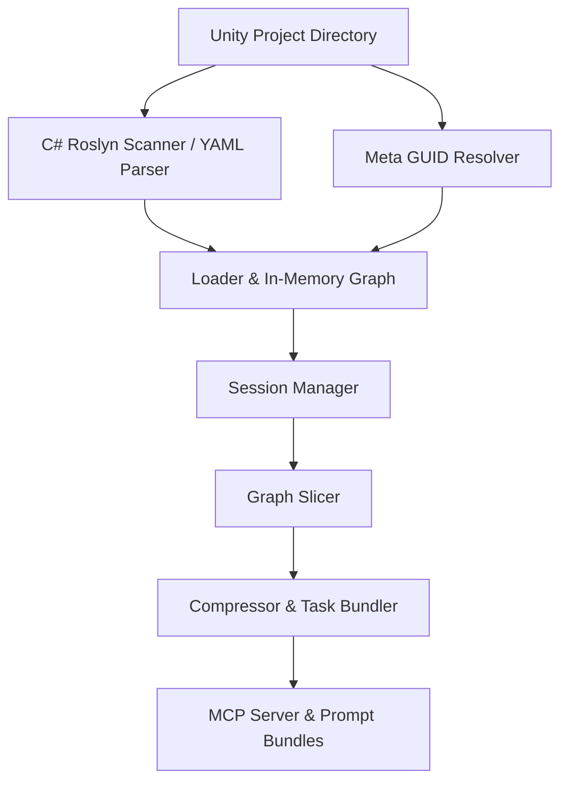

# Unity Context Slicer

[](https://badge.fury.io/py/unity-context-slicer)
[](https://opensource.org/licenses/MIT)
[](https://www.python.org/downloads/)
[](https://modelcontextprotocol.io)

**Unity Context Slicer** is a graph-based context extraction engine and Model Context Protocol (MCP) server designed for Unity projects. It parses C# scripts, Unity scenes (`.unity`), prefabs (`.prefab`), and `.meta` asset GUIDs into an in-memory knowledge graph. By slicing targeted $N$-hop neighborhoods around relevant components and compressing raw YAML/AST structures, it delivers **5–10× token reduction**, producing compact context bundles optimized for local and cloud LLMs.

---

## ⚡ Quick Start (Zero Install)

Run the server directly without installing Python dependencies using `uvx`:

```bash
uvx unity-context-slicer --project-dir "path/to/YourUnityProject"
```

Or install via `pip`:

```bash
pip install unity-context-slicer
unity-context-slicer --project-dir "path/to/YourUnityProject"
```

---

## 🔑 Key Features

* **🕸️ Graph-Based Project Indexing**: Maps C# classes, methods, events, Unity GameObjects, MonoBehaviours, scenes, and prefabs into a unified directed graph.
* **⚡ 5–10× Context Compression**: Converts verbose scene YAML and code structures into dense, high-information text representations suited for restricted LLM context windows (e.g., 7B local models).
* **🎯 Focused Slicing**: Extracts $N$-hop relational neighborhoods (`unity_slice`) or comprehensive class context cards (`unity_class`) including method callers, attached scene objects, and inheritance hierarchies.
* **🔄 Auto-Reloading Resident Session**: Monitors file modification times (`mtime`) across `.cs`, `.unity`, and `.prefab` files to update the resident graph in milliseconds upon code changes.
* **🔌 Built-in MCP Server**: Exposes stdio-based MCP tools for direct integration with MCP clients such as Cursor, Windsurf, Claude Desktop, VS Code (Cline / Roo Code), and custom AI agents.
* **🆔 Unity GUID Resolution**: Resolves `.meta` file GUIDs to bridge C# MonoBehaviours with serialized scene/prefab component references.

---

## 🛠️ Architecture & Pipeline



### Pipeline Steps
1. **Parsing & Resolution**: C# AST analysis via Roslyn ([ScannerCore.cs](file:///d:/MyGames/unity-context-slicer/unity_context_slicer/csharp_scanner/ScannerCore.cs)) combined with Python-native Unity scene/prefab parsing ([unity_parser.py](file:///d:/MyGames/unity-context-slicer/unity_context_slicer/unity_parser.py)) and GUID resolution ([meta_resolver.py](file:///d:/MyGames/unity-context-slicer/unity_context_slicer/meta_resolver.py)).
2. **Graph Construction**: Builds a unified node/edge model in [ProjectGraph](file:///d:/MyGames/unity-context-slicer/unity_context_slicer/loader.py#L48-L100) indexed for bidirectional lookup.
3. **Neighborhood Slicing**: [SubGraph](file:///d:/MyGames/unity-context-slicer/unity_context_slicer/slicer.py) algorithms isolate relevant subgraphs based on class, method, or GameObject seeds.
4. **Dense Compression**: Renders subgraphs into task-ready prompt context via [compressor.py](file:///d:/MyGames/unity-context-slicer/unity_context_slicer/compressor.py).

---

## 🔌 MCP Tools Provided

| Tool Name | Description |
| :--- | :--- |
| `unity_search` | Search for project graph nodes by name substring and optional node type (`class`, `method`, `scene`, `prefab`, etc.). |
| `unity_class` | Retrieve structured class context (methods, callers, attached GameObjects/scenes, inheritance). |
| `unity_slice` | Extract an $N$-hop neighborhood graph surrounding a target seed node. |
| `unity_bundle` | Generate a full LLM coding prompt context bundle combining task requirements, graph context, and constraints. |
| `unity_stats` | View graph node and edge count statistics. |
| `unity_reload` | Force-reload the project graph from disk. |

---

## 🤖 Integration Guide for Popular Coding Agents

### 1. **Cursor**
Navigate to **Cursor Settings** $\rightarrow$ **Features** $\rightarrow$ **MCP Servers** and click **+ Add New MCP Server**:
* **Name:** `unity-context-slicer`
* **Type:** `command`
* **Command:** `uvx unity-context-slicer --project-dir "${workspaceFolder}"`

### 2. **Claude Desktop**
Add to your `claude_desktop_config.json`:
```json
{
  "mcpServers": {
    "unity-context-slicer": {
      "command": "uvx",
      "args": [
        "unity-context-slicer",
        "--project-dir",
        "C:/Path/To/Your/UnityProject"
      ]
    }
  }
}
```

### 3. **Windsurf (Codeium)**
Add to `~/.codeium/windsurf/mcp_config.json`:
```json
{
  "mcpServers": {
    "unity-context-slicer": {
      "command": "uvx",
      "args": [
        "unity-context-slicer",
        "--project-dir",
        "${workspaceFolder}"
      ]
    }
  }
}
```

### 4. **VS Code Extensions (Cline / Roo Code / Continue.dev)**
Add to your extension's MCP server configuration JSON:
```json
{
  "mcpServers": {
    "unity-context-slicer": {
      "command": "uvx",
      "args": [
        "unity-context-slicer",
        "--project-dir",
        "${workspaceFolder}"
      ]
    }
  }
}
```

---

## 💡 Recommended Agent Rules (`.cursorrules` / `.windsurfrules`)

To help AI coding agents use Unity Context Slicer effectively, add this instruction to your project's rule file:

```markdown
When answering questions or writing C#/Unity code:
1. Use `unity_search` to discover relevant classes, methods, or scene GameObjects.
2. Use `unity_class` to inspect MonoBehaviour callers, attached scene objects, and class inheritance.
3. Use `unity_bundle` before initiating large refactors to receive a compressed graph context bundle.
```

---

## 📁 Repository Structure

* [unity_context_slicer/](file:///d:/MyGames/unity-context-slicer/unity_context_slicer)
  * [mcp_server.py](file:///d:/MyGames/unity-context-slicer/unity_context_slicer/mcp_server.py) — FastMCP stdio server implementation and tool definitions.
  * [loader.py](file:///d:/MyGames/unity-context-slicer/unity_context_slicer/loader.py) — Data primitives ([GraphNode](file:///d:/MyGames/unity-context-slicer/unity_context_slicer/loader.py#L22-L31), [GraphEdge](file:///d:/MyGames/unity-context-slicer/unity_context_slicer/loader.py#L33-L46)) and graph indexing.
  * [slicer.py](file:///d:/MyGames/unity-context-slicer/unity_context_slicer/slicer.py) — Neighborhood traversal and class context extraction.
  * [compressor.py](file:///d:/MyGames/unity-context-slicer/unity_context_slicer/compressor.py) — Dense text formatting and LLM context reduction.
  * [session.py](file:///d:/MyGames/unity-context-slicer/unity_context_slicer/session.py) — Resident [GraphSession](file:///d:/MyGames/unity-context-slicer/unity_context_slicer/session.py#L22-L100) manager with stale file detection.
  * [unity_parser.py](file:///d:/MyGames/unity-context-slicer/unity_context_slicer/unity_parser.py) — Scene and prefab document structure extractor.
  * [meta_resolver.py](file:///d:/MyGames/unity-context-slicer/unity_context_slicer/meta_resolver.py) — Mapping between `.meta` GUIDs and C# source files.
  * [annotations.py](file:///d:/MyGames/unity-context-slicer/unity_context_slicer/annotations.py) — Annotation cache for node purpose metadata.
  * [task_log.py](file:///d:/MyGames/unity-context-slicer/unity_context_slicer/task_log.py) — Task history parser and context embedder.
  * [csharp_scanner/](file:///d:/MyGames/unity-context-slicer/unity_context_slicer/csharp_scanner) — C# Roslyn scanner project ([CSharpScanner.csproj](file:///d:/MyGames/unity-context-slicer/unity_context_slicer/csharp_scanner/CSharpScanner.csproj)).

---

## 📜 License

This project is licensed under the [MIT License](file:///d:/MyGames/unity-context-slicer/LICENSE).
